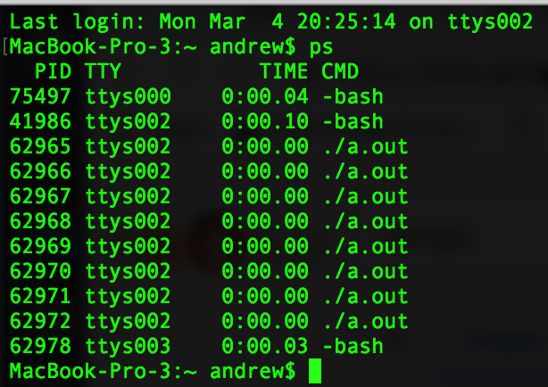
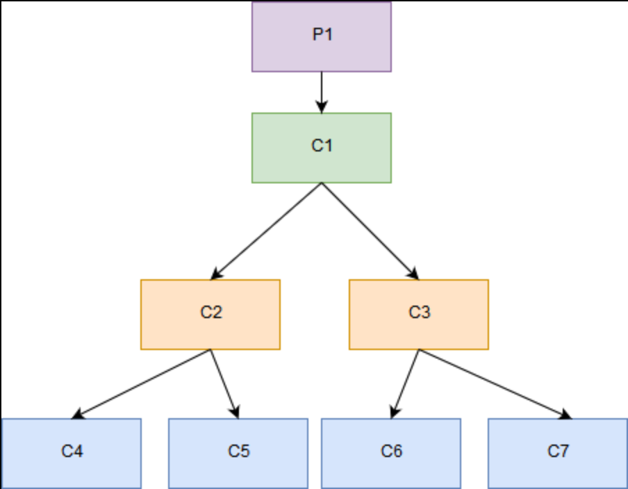

## **Problems 1-9** <br> By: Simon, Andrew, Riley

=================================================

### 1)

#### Answer/Explanation

The problem with reversing the steps is that assuming that if the thread is woken up, we need to make sure that the scheduler doesn't run on another core until we switch to the scheduler and save the registers. If we were to reverse the steps then lets say the scheduler does run on another core before saving the registers then that information is lost and valuable time and money is wasted. Also it will run the same thread over again when the user doesn't want it to.

### 2)

#### Answer/Explanation

Replacing the lines with the given two lines would be a bug because we need to have a snapshot to make sure no other concurrent thread has snuck in and sold a ticket by comparing it to the previous snapshot. So lets say we ignore checking the snapshot, then there is the potential to have people sneaking in because there is no validation that the amount of seats and the cashOnHand are still the same after the audit method is called.

### 3)

```java
public class BoundedBufferTester extends BoundedBuffer {
   /**
   * the main method which calls all of the test methods in the class
   * @param args String[] array containing command line parameters
   * @return void
   */
   public static void main ( String [] args ) throws Exception {
      test_insert();              // 1 tests
      test_retrieve();            // 3 tests
   }
     
    /**
     * test method to test out the operation of the insert method from BoundedBuffer
     */
   public static void  test_insert() {
      BoundedBuffer oofTesterOne = new BoundedBuffer();
      Object o = new Object();
      System.out.println( "\n3 TESTS FOR insert():" );
      try { 
         oofTesterOne.insert(o);
         System.out.println("Object Inserted");
      }
      catch( Exception e ) { System.out.println ( "Exception: " + e ); }
   }
  
    /**
     * test method to test out the operation of the retrieve method from BoundedBuffer
     */
   public static void test_retrieve() {
      BoundedBuffer oofTesterOne = new BoundedBuffer();
      Object z = new Object();
      try { 
         oofTesterOne.insert(z);
         oofTesterOne.retrieve();
         System.out.println("Object Retrieved");
      }
      catch( Exception e ) { System.out.println ( "Exception: " + e ); }
   }
}
```

#### Answer/Explanation

Tester that tests the insert and retrieve methods.

### 4)

```java
public class BoundedBufferModifiedClass {
    private Object[] buffer = new Object[20]; // arbitrary size
    private int numOccupied = 0;
    private int firstOccupied = 0;
    /* invariant: 0 <= numOccupied <= buffer.length
    0 <= firstOccupied < buffer.length
    buffer[(firstOccupied + i) % buffer.length]
    contains the (i+1)th oldest entry,
    for all i such that 0 <= i < numOccupied */
    public synchronized void insert(Object o) throws InterruptedException {
        while(numOccupied == buffer.length)
        // wait for space
        wait();
        buffer[(firstOccupied + numOccupied) % buffer.length] = o;
        numOccupied++;
        // in case any retrieves are waiting for data, wake them
        notifyAll();
    }
    public synchronized Object retrieve() throws InterruptedException {
        while(numOccupied == 0)
        // wait for data
        wait();
        Object retrieved = buffer[firstOccupied];
        buffer[firstOccupied] = null; // may help garbage collector
        firstOccupied = (firstOccupied + 1) % buffer.length;
        numOccupied--;
        // in case any inserts are waiting for space, wake them
        // #4
        if (buffer.length == 0 || buffer.length == 20) {
            notifyAll();
        };
        return retrieved;
    }
}
```

#### Answer/Explanation

We call the notifyAll() function when the buffer length is zero or its max length, 20, which is declared at the start of the buffer class. We also changed the tester and it works for the BoundedBufferModifiedClass.

### 5)

#### Answer/Explanation

a) No, in “two-phase locking”, there is an expanding phase where locks are acquired and no locks are released, and a shrinking phase, where locks are released, and no locks are acquired. If T1 writes new values into x and y and T2 reads the values of both x and y, then T2 will only be able to read the values after T1 has written the new ones and the lock has been released.

b) Yes, “read committed” results in exclusively locking the write transactions only whereas the read transactions use a shared lock which is acquired before each read and is released immediately after. This means that T2 will have the chance to read older values as well as newer values, such as the old value of x and the new value of y.

c) Yes, in the situation of “snapshot isolation”, each write action stores the new value for an entity in a different location than the old value. Therefore, a read action will not need to read the most recent version: it can read an older version. So, in this case, T2 would be able to read an older x as well as a new value of y.

### 6)

#### Answer/Explanation

The virtual address of the last word in page 6 is 16380 and the virtual address first word of page 6 is 12288.

### 7)

#### Answer/Explanation

The numbers 1047552 and 1047553 come from the index of the last page table. Each page table has 1024 frames and there is a range from 1024 to 2047 so the address 1047552 and the page address behind it is 1047553.

### 8)

```c
#include <stdio.h>
//gcc problemEight.c && ./a.out
int main() {
  char bytes[204800];
  size_t sizeOfArray = sizeof(bytes);

  int i;
  int j;
  
  for (size_t j = 0; j < 100; j++) {
    for(i = 4095; i < sizeOfArray; i += 4096) {
      bytes[i];
    }
  }

  return 0; 
}
```

#### Answer/Explanation

On a laptop running MacOS, created an array of chars to represent the bytes, and created a variable to store the size of the array.  Then created an outer `for` loop to run an arbitrary number of times and within that loop is another `for` loop that starts at the 4096th byte of the char array and accesses each successive 4096th byte. The time per array access is instant and no change in array size changes the time; this is because array accesses are in constant time since arrays know where each piece of the data is and they don't need to parse through the previous members of an array to find a member at any given spot.

### 9)

```c
#include <unistd.h>
//gcc problemNine.c && ./a.out
int main(int argc, char **argv) {
   int i; for(i = 0; i < 3; i++) {
      /* loops 3 times */ fork();
      /* each time calling fork */
   } 
   sleep(30); /* then sleeps 30 seconds */
}
```





#### Answer/Explanation

There are 8 processes.